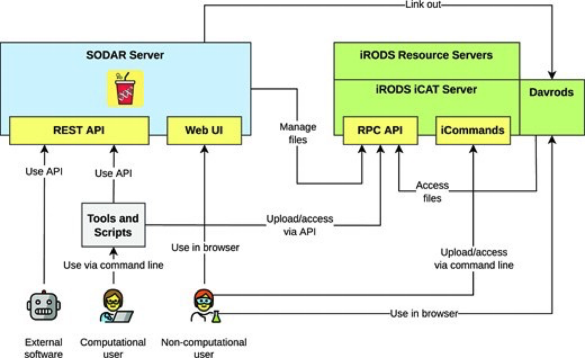
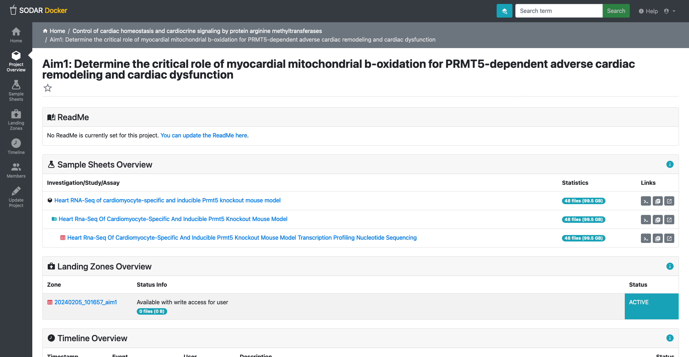
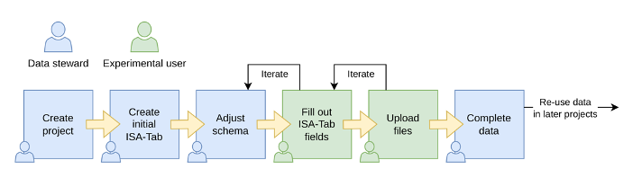

::: objectives
-   Introduce the idea of OMICs and explain why they are important in bioinformatics.
-   File Formats in Bioinformatics: overview of FASTQ, SAM/BAM/CRAM.
-   Understanding the multilayered nature of metadata from OMICs experiments.
:::

## Overview

**S**ystem for **O**mics **D**ata **A**ccess and **R**etrieval (**SODAR**) is data management solution presented to the end-user as web-applicaiton. SODAR is developed by the [Core Unit Bioinformatics](https://www.cubi.bihealth.org/) at the [Berlin Institute of Health](https://www.bihealth.org/). The main use is to link files to their metadata.

### SODAR components and data workflow

Figure 1. Overview of data workflow with SODAR.

#### SODAR server

#### iRODS server

An iRODS stands for Integrated Rule-Oriented Data System, is a data management system that allows users to control data provenance.

It enables the addition of customized metadata attributes to stored data, facilitating tracking and management of original input and results

It supports extensive testing on various platforms and has a plugin architecture that accommodates microservices, storage systems, authentication, networking, databases, rule engines, and an extensible API.

The system includes a rule engine for workflow automation, allowing users to create customized workflows triggered by specific system activities

iRODS provides storage virtualization among heterogeneous file systems, meaning it allows data to be stored in different computers or external servers ('cloud') and still be systematic organized in terms of metadata. The usual use case is for organizing unstructured data.

The iCAT server serves as a metadata catalog that supports large facility experimental data, linking all aspects of the research chain from proposal through to publication. It utilizes a relational database for storing metadata in the form of "triples," consisting of an attribute field, a value field, and a unit field.

### SODAR naming and concepts

#### Web-UI

asss

#### REST-API

asss

#### Landing Zones:

aasss

#### Sample sheets:

aaassss

#### Time line:

assss

### Members and project access

Fig2. SODAR project page overview.

### SODAR data workflow step-by-step usage

{width="847"}

1.  Create a project <https://sodar-test.dieterichlab.org/project/project/create>

2.  Create a subproject [https://sodar-test.dieterichlab.org/project/project/create/](https://sodar-test.dieterichlab.org/project/project/create/f2688cf8-67f2-450d-ae69-97d5fda66faf){.uri}\<project_uid\>

3.  Create a sample sheet: Sample sheets \> Sheet operations \> Create from template

    1.  Select ISA-Tab Template (Bulk RNA sequencing ISA-tab template)
    2.  Import Sample Sheets from ISA-Tab

4.  Upload files

    1.  Use \<[cubi-tk](https://github.com/bihealth/cubi-tk) sodar inger\>

    2.  Use iRODs [iput](https://docs.irods.org/master/icommands/user/#iput)

5.  Call SODAR validation

? URL for sheet synchronization

? iRODS public access ticket

? IGV session genome
