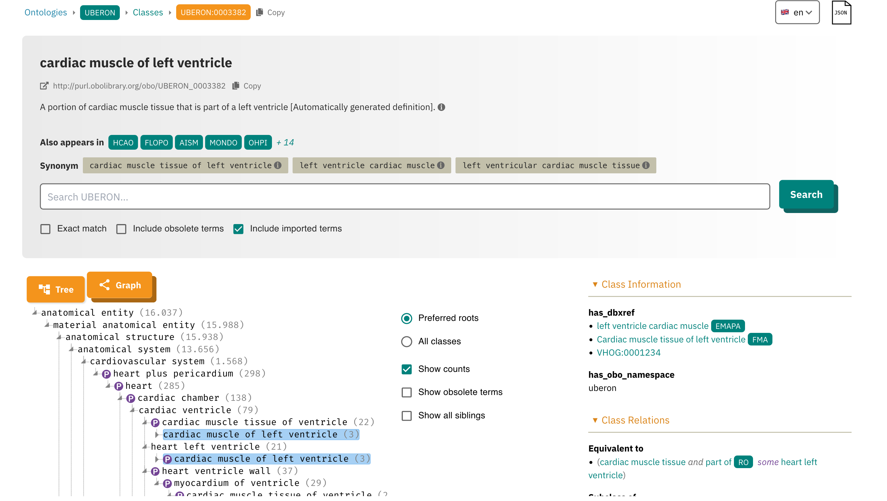

::: questions
-   What actions can we take adhere to FAIR framework?
:::

::: objectives
-   Understand the FAIR framework applied to OMICs research
-   Discuss solution the INF data management team can provide so the project adhere to the FAIR framework
:::

# Reminder of FAIR framework

This chapter aims to give a deep dive on FAIR framework.

-   **Findable**: Metadata helps in uniquely identifying data for easy discovery.
-   **Accessible**: Metadata includes information on how data can be accessed.
-   **Interoperable**: Standardized metadata ensures that data can be integrated with other datasets.
-   **Reusable**: Metadata provides the information necessary for data to be reused effectively, including the conditions under which it can be reused.

## Findable

The “Findable” aspect of the FAIR principles emphasizes the need for data to be easily located and identified. This is the first step in ensuring that data can be used and reused effectively. Metadata plays a crucial role in making data findable by providing information about the data, such as its title, publication, author, and description. This information helps users to locate and identify the data they need for their research. Or describing sample location (left-ventricle vs. right ventricle), library preparation type (Poly-A enrichment vs. Ribo depletion).

Another important aspect for findability is the use of persistent identifier. One every day aspect is nomenclature used for genes or proteins in manuscripts. While the use of nomenclature standards advanced, use of common names can lead to ambiguities or confusion. In that case, the use of persistent identifier, such as the [Ensembl's Stable IDs](http://www.ensembl.org/info/genome/stable_ids/index.html) or [UniProt accession numbers](https://www.uniprot.org/help/accession_numbers) are preferred. The Digital Object identifier ([DOI](https://dx.doi.org/)) is used to make data, software, and other research outputs easily citable and trackable.

Metadata can also facilitate data discovery. For example, metadata can be used on

## Accessible

Making data accessible to collaborators and the public increases its impact. Our INF aims to facilitate and automatize the limited or public distribution of data sets. The critical point is establishing user access with granularity.

The Member Roles in SODAR are structured to provide varying levels of access and functionality within projects. Each user can hold only one role at a time within a category or project, with "project" serving as a generic term encompassing both categories and specific projects. The roles, listed in descending order of rights and functionality, include:

1.  **Project Owner**: Holds full access to project data and functionality, with the ability to assign roles, including delegates. They can transfer ownership to another user.

2.  **Project Delegate**: Possesses full access to project data and functionality, except for modifying owner or delegate roles. This role can only be assigned by a project owner.

3.  **Project Contributor**: Granted access to create and modify data within a project, such as uploading files and editing sample sheets, with certain limitations. They cannot modify project metadata or user roles.

4.  **Project Guest**: Limited to read-only access to project data.

5.  **Project Finder**: Exclusive to users in categories, allowing them to view child categories and projects, along with member lists, without accessing project data or apps. This role is useful for staff members who need an overview of the category and project structure.

Role inheritance is implemented, with roles inherited from parent categories. These inherited roles can be promoted for the current category or project but cannot be demoted. Inherited roles are denoted in the member list, indicating the category from which the role is inherited.

Additionally, each project must have one local owner who is not inherited.

Moreover, standardized metadata can facilitate data users to find your data set on specialized search engines, such as [Sequence Read Archive](https://www.ncbi.nlm.nih.gov/sra), [European Nucleotide Archive](https://www.ebi.ac.uk/ena/browser/), and [Gene Expression Omnibus](https://www.ncbi.nlm.nih.gov/geo/), or other engines, such as the [METASra](https://metasra.biostat.wisc.edu/) or the [SRA explorer](https://sra-explorer.info/). The more data users find your data set, the more likely it receives citations.

## Interoperable

Data interoperability refers to the ability of different systems, organizations, and applications to access, exchange, and use data seamlessly and effectively. It ensures that data from diverse sources can be integrated and utilized cohesively, regardless of the differences in their formats, structures, or origins. For data to be interoperable, it must meet the following key criteria:

1.  Machine-readable.
2.  Standardized formats and processing steps.
3.  Using common vocabularies and ontologies.

Adhering to these criteria facilitates data use and integration, as well further analysis, such meta analysis or database inclusion. The main action here is selecting a common ontology to describe experiments. Please check this resource to see how ontologies work: [ols4 left ventricle query](https://www.ebi.ac.uk/ols4/search?q=left+ventricle).



## Reusable

Data set reusability is the final goal of the FAIR framework. Reusability requires adhering to four key concepts:

-   The data complies with the Findable, Accessible and Interoperable principles.
-   Data and metadata can be validated.
-   Data permission and licensing.

### Data validation

Another important concept is providing standardized file formats and validating such files. Using MD5 checksums for file sharing and validation is important because it ensures data integrity. Before a file is shared, an MD5 checksum should be generated, which is a unique hash value representing the file's content. The recipient can generate their own MD5 checksum for the received file and compare it with the original checksum. If the values match, it confirms that the file has not been altered or corrupted during transmission, ensuring the file's integrity and authenticity.

Here is an example of how to test a file checksum manually:


``` bash
echo "this is a text file." > test_checksum.txt
cat test_checksum.txt
> this is a text file.
md5sum test_checksum.txt > test_checksum.md5
cat test_checksum.md5
> bc8a22e96d2b46f583a8c5fb055de679  test_checksum
md5sum --check test_checksum.md5
>test_checksum: OK
```

``` output
Error in running command bash
```

### Metadata validation

There are specialized tools for validating metadata. SODAR uses [altamisa](https://github.com/bihealth/altamisa){.uri}. SODAR user interface will display errors and warning in case of parsing errors for the metadata files.

### Data licenses

::: callout
#### Disclaimer

This section does not aim to discuss legal aspects of data sharing, but to provide an overview of the importance of data licenses. For legal advice, please consult a legal expert.
:::

Data licenses are legal instruments that define the terms and conditions under which data can be used, shared, and distributed. They provide a framework for data users to understand their rights and obligations when using data, including the permissions granted by the data provider and any restrictions on data use.

In legal terms, data and software can only be re-used if it licensed. Data deposited to the SRA (Sequence Read Archive) is licensed under the [NCBI data use policy](https://www.ncbi.nlm.nih.gov/home/about/policies/). This license provides open access to raw sequencing data, including RNA-seq data, under the public domain license. This means the data can be freely used, modified, and shared by anyone for any purpose without restrictions.

::: keypoints
-   The FAIR framework is central for data and metadata management.
-   Data sets can be made more reusable by taking simple actions.
:::
